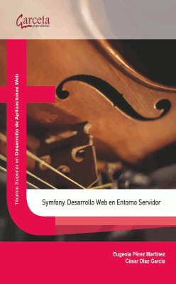

# README

## Para qué es este repo?

Este repo plantea una breve introducción al uso del framework symfony, y poner en práctica la introducción del [Getting Started](https://symfony.com/doc/3.4/setup.html) de la documentación oficial de este software.

Se recomienda encarecidamente visionar y practicar con [el material suministrado en la plataforma Symfony Cast](https://symfonycasts.com/screencast/symfony3), que consta de 12 vídeos donde se realiza una breve intro a este framework.

En este repo se tratan aspectos como la **autenticación de usuarios** y uso de **doctrine** que no se trataron en los materiales indicados.

## Requisitos y dependencias

* Composer `v1.8.4` o superior
* PHP `v7.2` o superior
* Symfony `v3.4` exactamente esta versión y sus derivadas (minor versions)


## Lo que se pretende aprender de este ejercicio

* Selección de herramientas de programación
* Patrón Arquitectónico Modelo-Vista-Controlador
* Interacción por shell
* Generación de páginas con Symfony 3.4
* Definición de Controladores con Symfony 3.4
* Usando Servicios con Symfony 3.4 y su contenedor
* Routing con Symfony 3.4
* Motor de plantillas Twig
* Mecanismos de autenticación con Symfony 3.4

## Antes de ponerte a trabajar...

### Haz un fork del repositorio original

Haz un fork del repositorio original y configúralo de forma privada (la actividad propuesta es individual ;)
Habilita las issues e indica que es un proyecto Java.


### Clona el repositorio

```
git clone <url de tu fork>
```


Puedes utilizar otro mecanismo para compilar o empaquetar el programa a través del IDE o a través de otra herramienta.

### Ejecuta el programa

 Sitúate en la carpeta raiz del proyecto y realiza las siguientes operaciones
 
```
composer update
```

Inicializa un server que levante los servicios de symfony utilizando el siguiente comando:

```
# Inicializa el servicio bloqueando la terminal
php bin/console server:run

# Inicializa el servicio en segundo plano
php bin/console server:start
```

### Crea tu rama de trabajo

Crea tu propia rama de trabajo! Crea una nueva rama a partir de master que se llame como el nombre de tu usuario en el curso. Te recuerdo cómo:

```
git checkout -b <usuario>
```

Tu solución final deberá estar apuntada por esta rama. Puedes utilizar todas las ramas que quieras, pero **no trabajes en la master** y asegúrate, si tienes otras ramas que forman parte de tu solución, de combinarlas con tu rama con el nombre de tu usuario.


## Ponte a trabajar

### Se va a realizar un ejemplo de autenticación
______________________________________________

En Symfony la seguridad se gestiona a través del fichero `app\config\security.yml` Revisa el estado actual de este fichero.

Lo primero que vas a hacer es crear una página que, accediendo desde la ruta `http:\\<URL>\admin` reponda en texto plano con lo siguiente:

```
Welcome to the admin area
```

Puedes hacerlo manualmente pero asegúrate de también tratar de crear el controlador ayudándote del comando:

```
php bin/console generate:controller
```

Vamos a limitar solo a usuarios autenticados el acceso a esta página de la siguiente forma:

Modifica el fichero `app\config\security.yml`

```
in_memory:
            memory: 
                users:
                    usuario1:
                        password: abc123.
                        roles: 'ROLE_ADMIN'
                    usuario2:
                        password: abc123.
                        roles: 'ROLE_GUEST'
```

Desconmenta la línea `http_basic: ~` y revisa la doc que se indica.

Añade al final del mismo documento estas líneas donde se le da acceso a usuarios con rol admintrador a paths que empiecen con admin.

```
    access_control:
            - { path: ^/admin, roles: ROLE_ADMIN }
    
    # Esta línea indicará cómo se enviará la contraseña desde el cliente al servidor. Se le indica en testo plano.        
    encoders:
        Symfony\Component\Security\Core\User\User: plaintext
```

Accede a `http:\\<URL>\admin` y comprueba el funcionamiento. Prueba con ambos usuarios o crea nuevos. Inspecciona la barra de debug.
comenta las líneas donde se especifica `encoders` y comprueba si sigue funcionando o no.

Finalmente, etiqueta tu versión con la tag `v1.0-nombreUsuario`

### Se va a crear un formulario de login propio
______________________________________________


En el apartado anterior se ha visto cómo implementar un login funcional pero algo rudimentario. Sería mucho más conveniente disponer de un formulario de login integrado en la propia App que un cuadro de diálogo en el navegador.

Para conseguirlo se va a añadir en el fichero `app\config\security.yml`, en la sección `main` la clave `form_login`

```
# https://symfony.com/doc/current/security/form_login_setup.html
form_login:
	login_path: /login
	check_path: /loginCheck
```

Ahora es necesario crear dos accionesa las que llevar el flujo de ejecución cuando el usuario pida una ULR que coincida con las rutas `/login` y `/login_check`.

1. **Debes crear un controlador** llamado `SecurityController` que incluya estas dos acciones: `loginAction` y `loginCheckAction` mapeadas a las rutas mecionadas.

2. **Implementa la acción** `loginAction` de tal forma que devuelva en forma de plantilla un formulario de login. Toma de referencia un formulario utilizado en proyectos previos. Lo tienes en [doc/resources/login.php](doc/resources/login.php). **Adapta este form a una plantilla twig**.

3. El formulario debe indicar en una sección `<div>` si en un submit previo hubo algún error. Por ejemplo, un mensaje sobre credenciales inválidas. Para ello **debes pedirle a Symfony esta información**. Utiliza el servicio `authentication_utils`. Para obtener acceso al servicio del containes, localiza la clave de este servicio empleando el comando de terminal `php bin/console`. Puedes obtener el último error de autenticación de la siguiente forma:

	```
	$error = $autenticacion->getLastAuthenticationError();
	```
	
	Pásale este error como parámetro al render de la plantilla para mostrarlo en la salida html.

4. Para que al **hacer submit de las credenciales Symfony procese la validación**, el formulario debe satisfacer estas condiciones:
	* El formulario debe utilizar el método POST y enviar sus datos a la url que apunta a la acción `loginCheckAction`. En el controlador no será necesario implementar nada para esta acción ya que Symfony se encargará de recibir la petición de login y hacer la comprobación de las credenciasles por nosotros.
	* Los elementos *input* de HTML del formulario deben tener los valores contenidos en las claves `_username` y `_password`.

Llegado a este punto, al acceder a la dirección `http:\\<URL>\login`, deberías poder ver el formulario de login y autenticarte con él.

Finalmente, etiqueta tu versión con la tag `v2.0-nombreUsuario`


### Recuperando los usuarios de la base de datos
______________________________________________

Si bien hasta ahora en el ejemplo hemos utilizado una clase `User` facilitada por Symfony ubicada en `Symfony\Component\Security\Core\User\User`, lo normal será que queramos utilizar una clase `Usuario` creada por nosotros mismos con las propiedades que requiera nuestra App. Y que los datos de las instancias de esta clase persistan almacenadas en una base de datos.

1. Para ello, **vamos a crear una base de datos** con una tabla de usuarios, precargando esta tabla con tres registros que nos permitan probar la autenticación. Puedes utilizar el script que acompaña este repo:

	```
	# Asegúrate de tener acceso a la base de datos (este script 	asume sin contraseña para el root, modíficalo si te hace falta)
	./doc/resources/restoredb doc/resources/script-precarga-db.sql
	```

	Asegúrate de tener los datos sobre tu db correctamenta indicados en el fichero `app/config/parameters.yml`. Deberás tener lo siguiente:

	```
		database_name: dwcs_symfony
		database_user: dwcs
		database_password: abc123.
	```

	Si conectamos a la base de datos, deberíamos ver lo siguiente al describir la tabla:

	```
mysql> describe users;
	+-----------+--------------+------+-----+---------+----------------+
	| Field     | Type         | Null | Key | Default | Extra          |
	+-----------+--------------+------+-----+---------+----------------+
	| id        | int(11)      | NO   | PRI | NULL    | auto_increment |
	| nombre    | varchar(50)  | NO   |     | NULL    |                |
	| email     | varchar(100) | NO   | UNI | NULL    |                |
	| password  | varchar(50)  | NO   |     | NULL    |                |
	| role      | varchar(50)  | NO   |     | NULL    |                |
	| apellido1 | varchar(50)  | NO   |     | NULL    |                |
	| apellido2 | varchar(50)  | NO   |     | NULL    |                |
	+-----------+--------------+------+-----+---------+----------------+
	
	mysql> select * from users;
	+------+---------+-------------+----------+------------+-----------+-----------+
	| id   | nombre  | email       | password | role       | apellido1 | apellido2 |
	+------+---------+-------------+----------+------------+-----------+-----------+
	| 1001 | Fran    | admin@i.net | abc123.  | ROLE_ADMIN | García    | Álvarez   |
	| 1002 | Manolo  | alu@i.net   | abc123.  | ROLE_ALU   | Álvarez   | Álvarez   |
	| 1003 | Ignacio | prof@i.net  | abc123.  | ROLE_PROF  | Moreno    | Álvarez   |
	+------+---------+-------------+----------+------------+-----------+-----------+
	```

2. **Ahora toca generar nuestra propia clase** que represente a un usuario en el sistema. Para ello, se puede realizar manualmente, atendiendo a cómo realizar un [mapeo Objeto-Relacional](https://es.wikipedia.org/wiki/Mapeo_objeto-relacional), consultando la [documentación de Doctrine](https://symfony.com/doc/current/doctrine.html) o bien ayudarse del asistente por terminal. Se puede hacer esto último empleando el comando: `php bin/console doctrine:generate:entity`. **Emplea este generador de entidades** para crear una clase `User` que mapee todas las columnas de la tabla anteriormente descrita:

	Ten en cuenta que fallará si no están correctamente indicados los datos de acceso a la db en el fichero `app/config/parameters.yml` con el siguiente mensaje:
	
	```
	In PDOConnection.php line 47:
	                                                                                           
	  SQLSTATE[HY000] [2054] The server requested authentication method unknown to the client
	```

	**Completa el asistente interactivo** con la información que se solicita. Lee e interpreta la información que va dando. Finalmente, si toda ha ido bien, comprueba la clase `User` creada. Revisa la anotación ORM de la clase y **corrige para hacer corresponder la clase definida con la tabla que le corresponde en base de datos**. Nota: También se creará una clase `UserRepository` aunque en este punto no será necesario implementar nada en ella.
	
	**Ejecuta e interpreta los siguintes comandos**:
	
	```
	php bin/console doctrine:schema:drop # Dry-mode
	php bin/console doctrine:schema:drop --force
	php bin/console doctrine:schema:update # Dry-mode
	php bin/console doctrine:schema:update --force
	```
	
3. **Ahora es necesario implementar unas interfaces** en nuestra clase `User`. Esta clase además de nuestras propias implementaciones debe implementar las siguientes interfaces: `UserInterface`, `Serializable` y `EquatableInterface`. Dejo la implementación de estos métodos en el siguiente recurso: [doc/resources/contratoUserClass.txt](doc/resources/contratoUserClass.txt)

4. A continuación será necesario modificar de nuevo el fichero `app\config\security.yml` substituyendo la clave `in_memory` y todo lo que contiene por esto otro:

	```
	db_provider:
            entity:
            		# En class se especifica cúal es nuestra clase que representa al usuario
            		class: AppBundle:User
            		# En Property se representa la propiedad que identificará unívocamente al usuario
					property: email 
                
	```
	
	Se modificará también la clave `encoders` por lo siguiente:
	
	```
	encoders:
        #Symfony\Component\Security\Core\User\User: plaintext
        AppBundle\Entity\User: plaintext
	```
	
	De la sección `main` se modificará lo siguiente:
	
	```
	form_login:
		login_path: /login
		check_path: /loginCheck
		# default_target_path: after_login_route_name
	provider: db_provider
	logout:
		path: /logout
		target: /
	```
	
	De la clave `access_control` quedará así:
	
	```
	    access_control:
            - { path: ^/admin, roles: ROLE_ADMIN }
            - { path: ^/prof, roles: ROLE_PROF }
            - { path: ^/alu, roles: ROLE_ALU }
	```
	
	Realizando todos estos cambios, **comprueba el login** introduciendo cualquiera de los usuarios, junto a sus credenciales y comprobando la redirección al homepage. En la barra de debug, comprueba la correcta autenticación. **Comprueba la query lanzada a la db** igualmente utilizando la barra de debug .
	

### Creando una página de menú según el rol de usuario
______________________________________________

1. Crea una nueva acción en el controlador `Security`. Asígnale la ruta `loginAfter` y el siguiente nombre `after_login_route_name`

2. Descomenta la línea con la clave `default_target_path` perteneciente a la clave `form_login`. En lugar de la redirección a la homepage, el formulario de login ejecutará esta acción.

3. En función del rol del usuario podríamos realizar un redirect a diferentes rutas. Obtener el usuario para hacerle esta consulta y la redirección se hace a través del siguiente código:
	
	```
	$user = $this->getUser();
		if($user->getRole()==='ROLE_PROF'){
			return $this->redirectToRoute("menu_profesor");
		}
		else if($user->getRole()==='ROLE_ALU'){
			return $this->redirectToRoute("menu_alumno");
		}
		else if($user->getRole()==='ROLE_ADMIN'){
			return $this->redirectToRoute("app_admin_index");
		}
		else{
			throw $this->createAccessDeniedException();
		}
	```
	
4. Crea un nuevo controlador para el profesor y renderiza una template donde se genere el menú de acciones para este. Debe indicar el texto `Bienvenido, <nombreUsuarioLogueado>`. Puedes utilizar el siguiente recurso [doc/resources/MenuProfesor.tpl](doc/resources/MenuProfesor.tpl)
	
5. Crea un nuevo controlador para el alumno y renderiza una template donde se genere el menú de acciones para este. Debe indicar el texto `Bienvenido, <nombreUsuarioLogueado>`. Puedes utilizar el siguiente recurso [doc/resources/MenuAlumno.tpl](doc/resources/MenuAlumno.tpl)

**Finalmente, realiza las pruebas** con los tres usuarios diferentes cargados en la db. Los menús en este punto no tendrían que responder adecuadamente a sus submits.


## Estrategia de ramificación

Rama					| Uso
------------ 			| -------------
`master`	 			| Evolución del enunciado del ejercicio
`remote\usuario` 	| Evolución de la solución de cada alumno
`solución_x`			| Rama que representa una solución (puede derivar de master u otra rama)

### Changelog de enunciado:

Se irán etiquetando enunciados consolidados y entregados a alumnos:

Tag				| Descripción
------------ 	| -------------
`enum-v1`		| Enunciado inicial (autenticación nativa del agente de usuario)
`enum-v2`		| Autenticación completa (con form propio y doctrine)


### Snapshot actual del enunciado:

```Shell
.
├── LICENSE
├── README.md
├── app
│   ├── AppCache.php
│   ├── AppKernel.php
│   ├── Resources
│   │   └── views
│   │       ├── base.html.twig
│   │       └── default
│   │           └── index.html.twig
│   └── config
│       ├── config.yml
│       ├── config_dev.yml
│       ├── config_prod.yml
│       ├── config_test.yml
│       ├── parameters.yml.dist
│       ├── routing.yml
│       ├── routing_dev.yml
│       ├── security.yml
│       └── services.yml
├── bin
│   ├── console
│   └── symfony_requirements
├── composer.json
├── composer.lock
├── phpunit.xml.dist
├── src
│   └── AppBundle
│       ├── AppBundle.php
│       └── Controller
│           └── DefaultController.php
├── tests
│   └── AppBundle
│       └── Controller
│           └── DefaultControllerTest.php
├── var
│   ├── SymfonyRequirements.php
│   └── sessions
└── web
    ├── app.php
    ├── app_dev.php
    ├── apple-touch-icon.png
    ├── config.php
    ├── favicon.ico
    └── robots.txt

15 directories, 30 files

```

## Contribution guidelines

* Escribir tests
* Revisión de código

## Who do I talk to?

* Propietario del repo, proferor

_______________________
#Documentación Adicional
_______________________

Bibliografía
========================

* Symfony. Desarrollo Web en entorno servidor. Garceta. 2017. [ISBN: 978-84-1622-894-2](http://garceta.es/libro.php?ISBN=978-84-1622-894-2). Eugenia Pérez Martínez




Symfony Standard Edition
========================

**WARNING**: This distribution does not support Symfony 4. See the
[Installing & Setting up the Symfony Framework][15] page to find a replacement
that fits you best.

Welcome to the Symfony Standard Edition - a fully-functional Symfony
application that you can use as the skeleton for your new applications.

For details on how to download and get started with Symfony, see the
[Installation][1] chapter of the Symfony Documentation.

What's inside?
--------------

The Symfony Standard Edition is configured with the following defaults:

  * An AppBundle you can use to start coding;

  * Twig as the only configured template engine;

  * Doctrine ORM/DBAL;

  * Swiftmailer;

  * Annotations enabled for everything.

It comes pre-configured with the following bundles:

  * **FrameworkBundle** - The core Symfony framework bundle

  * [**SensioFrameworkExtraBundle**][6] - Adds several enhancements, including
    template and routing annotation capability

  * [**DoctrineBundle**][7] - Adds support for the Doctrine ORM

  * [**TwigBundle**][8] - Adds support for the Twig templating engine

  * [**SecurityBundle**][9] - Adds security by integrating Symfony's security
    component

  * [**SwiftmailerBundle**][10] - Adds support for Swiftmailer, a library for
    sending emails

  * [**MonologBundle**][11] - Adds support for Monolog, a logging library

  * **WebProfilerBundle** (in dev/test env) - Adds profiling functionality and
    the web debug toolbar

  * **SensioDistributionBundle** (in dev/test env) - Adds functionality for
    configuring and working with Symfony distributions

  * [**SensioGeneratorBundle**][13] (in dev env) - Adds code generation
    capabilities

  * [**WebServerBundle**][14] (in dev env) - Adds commands for running applications
    using the PHP built-in web server

  * **DebugBundle** (in dev/test env) - Adds Debug and VarDumper component
    integration

All libraries and bundles included in the Symfony Standard Edition are
released under the MIT or BSD license.

Enjoy!

[1]:  https://symfony.com/doc/3.4/setup.html
[6]:  https://symfony.com/doc/current/bundles/SensioFrameworkExtraBundle/index.html
[7]:  https://symfony.com/doc/3.4/doctrine.html
[8]:  https://symfony.com/doc/3.4/templating.html
[9]:  https://symfony.com/doc/3.4/security.html
[10]: https://symfony.com/doc/3.4/email.html
[11]: https://symfony.com/doc/3.4/logging.html
[13]: https://symfony.com/doc/current/bundles/SensioGeneratorBundle/index.html
[14]: https://symfony.com/doc/current/setup/built_in_web_server.html
[15]: https://symfony.com/doc/current/setup.html
